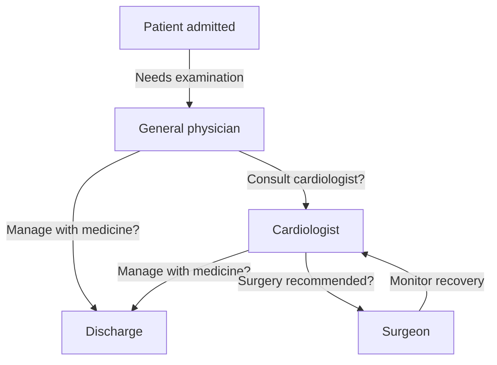

# LangGraph Hospital Agent

A minimal LangGraph project demonstrating the three foundational building blocks of the framework  - **State**, **Nodes**, and **Edges** - using a hospital patient-referral workflow as the example.

## Scenario

A patient is admitted to a hospital and passes through three specialists in sequence:

```
START → General Physician → Cardiologist → Surgeon → END
```

Each specialist:
1. Reads the notes left behind by the previous specialist (shared state)
2. Adds their own notes based on their "reasoning"
3. Passes the updated record along to the next specialist

This mirrors how a multi-agent LLM system works: each agent has access to a shared memory (state) and independently decides the next step based on what came before.

## Flow Diagram



This is the full decision flow, including the conditional branches (discharge vs. referral) and the monitoring loop back from surgeon to cardiologist. The current `app.py` implements the simple linear path (`physician → cardiologist → surgeon`); the conditional branches shown here are the planned next step (see below).

## Core Concepts

| Concept | Role in this project |
|---|---|
| **State** | A shared, typed dictionary (`PatientState`) that all nodes read from and write to — the patient's record |
| **Nodes** | Plain Python functions (`general_physician_node`, `cardiologist_node`, `surgeon_node`) — each a single unit of execution |
| **Edges** | Define which node runs next (`START → physician → cardiologist → surgeon → END`) |

## Project Structure

```
langgraph-hospital-agent-Langgraph/
├── app.py             # Graph definition and execution
├── requirements.txt   # Python dependencies
└── README.md
```

## Setup

1. Clone or download this folder.
2. Install dependencies:
   ```bash
   pip install -r requirements.txt
   ```

## Run

```bash
python app.py
```

### Expected Output

```
General Physician examining Rajesh
Cardiologist reading Physician notes
 -> Patient reports chest pain, shortness of breath, heart rate elevated.
Surgeon reading Physician & Cardiologist notes
 -> Physician: Patient reports chest pain, shortness of breath, heart rate elevated.
 -> Cardiologist: ECG shows irregularities, recommend surgery.

Final State:
{'patient_name': 'Rajesh', 'physician_notes': '...', 'cardiologist_notes': '...', 'surgeon_notes': '...'}
```

## Tech Stack

- Python 3
- [LangGraph](https://github.com/langchain-ai/langgraph)
